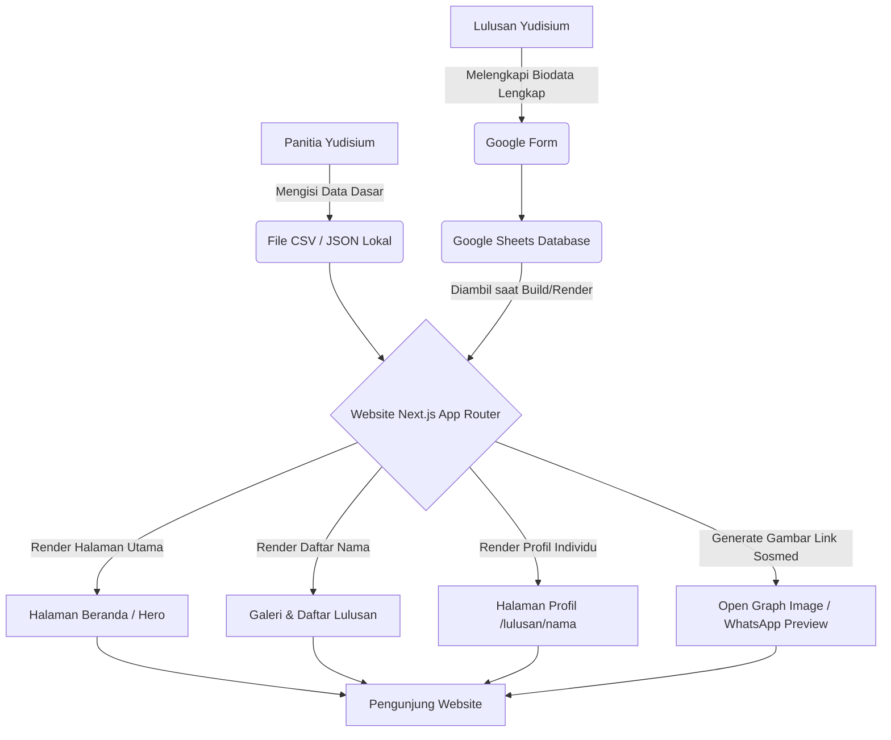

# Yudisium Ke-41 Fakultas Teknik Universitas Borneo Tarakan

Selamat datang di repositori resmi website profil **Yudisium Ke-41 Fakultas Teknik Universitas Borneo Tarakan (UBT)**. 

## 📖 Apa itu Website Ini? (Penjelasan Umum)

Website ini adalah sebuah platform profil digital eksklusif yang dipersembahkan khusus untuk **71 calon lulusan** Fakultas Teknik UBT pada perayaan Yudisium Ke-41. 

Website ini dirancang dengan gaya **Sinematik dan Premium** (seperti peluncuran produk Apple atau acara penghargaan bergengsi). Tujuannya adalah untuk merayakan pencapaian para lulusan dengan cara yang modern, elegan, dan abadi. Setiap lulusan memiliki "panggung"-nya sendiri di sini.

**Fitur Utama untuk Pengunjung:**
- **Profil Lulusan Spesifik:** Setiap lulusan memiliki halaman detail yang memuat foto resolusi tinggi, program studi, motto hidup, judul skripsi, pengalaman organisasi, hingga kontak media sosial (LinkedIn/Instagram).
- **Galeri Sinematik yang Interaktif:** Kumpulan foto kenangan yang bisa digeser (*swipe*) layaknya melihat Instagram Story.
- **Bagikan Momen Kelulusan:** Saat *link* profil lulusan dibagikan ke WhatsApp atau Instagram, website akan otomatis mencetak *thumbnail* gambar khusus bertuliskan nama lulusan tersebut secara dinamis.
- **Pengalaman Audio-Visual:** Dilengkapi dengan partikel emas yang melayang, teks yang muncul perlahan seperti *credit* film, dan musik latar (BGM) yang membangun suasana haru dan bangga.

---

## 📅 Informasi Acara Yudisium

- **Kegiatan Bimbingan Karier**
  - **Hari/Tanggal:** Selasa, 7 Juli 2026
  - **Tempat:** Gedung Rektorat Lantai 4, Universitas Borneo Tarakan
- **Acara Yudisium Ke-41**
  - **Hari/Tanggal:** Rabu, 8 Juli 2026
  - **Tempat:** Gedung Rektorat Lantai 4, Universitas Borneo Tarakan

---

## ⚙️ Alur Kerja Website (Flowchart)

Bagaimana cara website ini mendapatkan dan menampilkan data lulusan? Berikut adalah alurnya:



1. **Data Dasar:** Panitia menyiapkan nama dan foto dasar di file aplikasi lokal.
2. **Data Lengkap:** Lulusan mengisi Google Form secara mandiri (Motto, Riwayat Hidup, Judul Skripsi, dll) yang tersimpan di Google Sheets.
3. **Integrasi:** Website secara otomatis menarik data dari file lokal dan Google Sheets untuk dirakit menjadi halaman web yang utuh.
4. **Hasil Akhir:** Website menampilkan profil untuk dikunjungi dan dibagikan.

---

## 💻 Technical Documentation (Untuk Developer)

Proyek ini dibangun menggunakan **Next.js (App Router)**, **TypeScript**, dan **Tailwind CSS**. Animasi di-*handle* menggunakan **Framer Motion**.

### Getting Started

Untuk menjalankan aplikasi ini di komputer lokal Anda:

1. **Install dependensi:**
   ```bash
   npm install
   ```

2. **Jalankan Development Server:**
   ```bash
   npm run dev
   ```

3. **Buka di Browser:**
   Buka [http://localhost:3000](http://localhost:3000) untuk melihat hasilnya.

### Struktur Proyek Utama
- `app/`: Berisi semua rute halaman (seperti `app/page.tsx` untuk beranda dan `app/lulusan/[slug]/page.tsx` untuk profil dinamis).
- `components/`: Berisi seluruh komponen antarmuka pengguna (UI), terbagi menjadi `sections`, `graduates`, `layout`, dll.
- `lib/`: Berisi fungsi-fungsi utilitas, termasuk logika integrasi dengan Google Sheets (`sheets.ts`).
- `data/`: Berisi data statis awal seperti daftar nama kelulusan (`participants.json`).
- `public/`: Direktori untuk menyimpan aset publik seperti gambar, logo, dan file *audio* (`/audio/bg-music.mp3`).

### Deployment

Aplikasi ini dioptimalkan untuk di-deploy sebagai *Static Site* atau dalam kontainer seperti **Google Cloud Run** maupun **Vercel**. 
Karena menggunakan Dynamic Open Graph (`opengraph-image.tsx`), **sangat penting** untuk mengatur *environment variable* `NEXT_PUBLIC_SITE_URL` pada server production agar *preview* link WhatsApp dapat melakukan *generate* URL *absolute* dengan benar.

*Contoh Build:*
```bash
npm run build
npm run start
```
